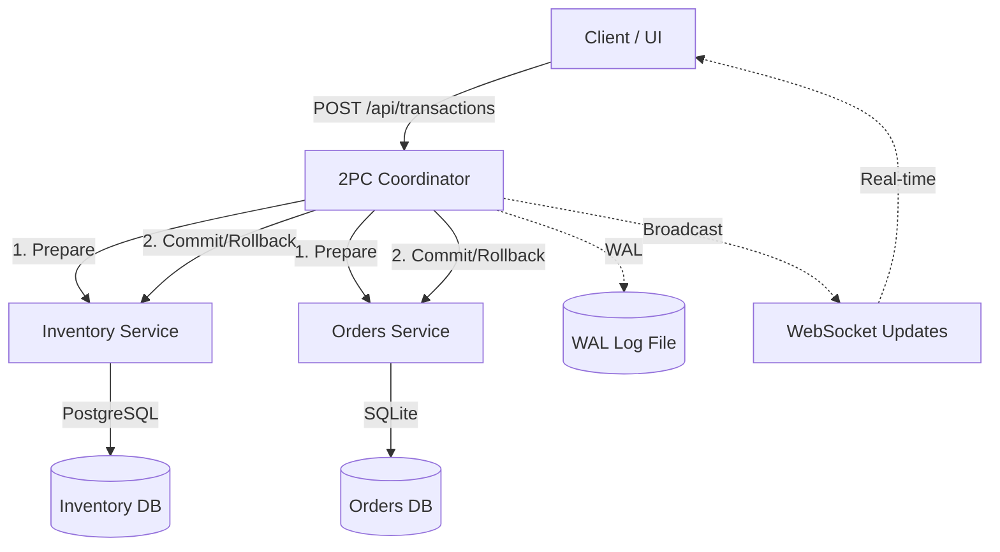

# Transactional Inventory System with 2-Phase Commit (2PC)

This project demonstrates a distributed inventory and order processing system utilizing the **Two-Phase Commit (2PC)** protocol to guarantee data consistency across microservices with heterogeneous data stores (PostgreSQL and SQLite).

## 1. Overview
In modern microservices, maintaining data consistency across different databases is a significant challenge. This project solves the "distributed transaction problem" by implementing a custom 2PC coordinator and participant logic from scratch, ensuring that stock deductions and order creation happen atomically.

## 2. Architecture Diagram



## 3. The Two-Phase Commit (2PC) Protocol

### Phase 1: Voting / Prepare
1.  **BEGIN**: Coordinator assigns a unique `transaction_id` and writes a `BEGIN` record to the Write-Ahead Log (WAL).
2.  **PREPARE**: Coordinator sends a `/prepare` request to all participants concurrently.
3.  **Vote**:
    *   **Inventory Service**: Acquires row-level locks (`SELECT ... FOR UPDATE`), verifies stock, and records the state as `PREPARED`.
    *   **Orders Service**: Creates an order record with status `PREPARED`.
4.  **Acknowledgment**: Each participant returns `200 OK` (Vote Commit) or `409/500` (Vote Abort).

### Phase 2: Completion
1.  **Decision**: If all participants voted Commit, the Coordinator writes `GLOBAL_COMMIT` to the WAL. If any voted Abort, it writes `GLOBAL_ABORT`.
2.  **Action**: Coordinator sends `/commit` or `/rollback` to all participants.
3.  **Finalization**: Once participants acknowledge, the Coordinator writes `END` to the WAL.

## 4. Getting Started

### Prerequisites
*   Docker and Docker Compose installed.

### Running the Application
To start the entire application, use Docker Compose from the root directory:

```bash
docker-compose up --build
```

### Accessing the System
*   **Monitor UI**: [http://localhost:5173](http://localhost:5173)
*   **Coordinator API**: [http://localhost:3000](http://localhost:3000)
*   **Inventory Service**: [http://localhost:3001](http://localhost:3001)
*   **Orders Service**: [http://localhost:3002](http://localhost:3002)

## 5. Component Breakdown

### 5.1. Coordinator Service (Node.js/Express)
*   **State Machine**: Manages the lifecycle of transactions.
*   **Write-Ahead Log (WAL)**: Ensures durability. The log is an append-only JSON line file located in `./data/coordinator.log`.
*   **Recovery Logic**: On startup, the coordinator scans the WAL and resolves any "In-Doubt" transactions automatically.
*   **WebSocket Server**: Broadcasts state changes to the UI for real-time monitoring.

### 5.2. Participant Services
*   **Inventory Service (PostgreSQL)**: Manages stock levels using strict row-level locking during the prepare phase.
*   **Orders Service (SQLite)**: Demonstrates heterogeneity by using a different data store while maintaining transactional integrity.

### 5.3. Frontend Monitor (React)
*   **Real-time Visualization**: Displays every step of the 2PC process.
*   **Chaos Engineering**: Features a "Chaos Button" to kill services via the Coordinator's Docker bridge, allowing you to test system resilience.

## 6. Fault Tolerance & Recovery
*   **Service Crash**: If a participant crashes after voting, the Coordinator retries the final decision until it succeeds.
*   **Coordinator Crash**: Upon restart, the WAL provides the "Ground Truth," allowing the system to finish pending commits or rollbacks.
*   **Idempotency**: All completion endpoints (`/commit`, `/rollback`) are idempotent, ensuring safety during recovery cycles.

## 7. Analysis: 2PC vs. Saga Pattern

| Feature | Two-Phase Commit (2PC) | Saga Pattern |
| :--- | :--- | :--- |
| **Consistency** | Strong (Atomicity) | Eventual Consistency |
| **Availability** | Lower (due to the Blocking Problem) | Higher (Services operate independently) |
| **Performance** | Slower (requires locking resources) | Faster (local transactions only) |
| **Rollback** | Automatic (handled by DB engine) | Manual (Requires compensating transactions) |

### The Blocking Problem in 2PC
2PC's fundamental weakness is **The Blocking Problem**. If the coordinator fails at a critical moment (after Prepare but before Commit), participants remain in an "in-doubt" state, holding exclusive locks on resources indefinitely. This is why many high-availability systems prefer the **Saga Pattern** or **Eventual Consistency** models.
